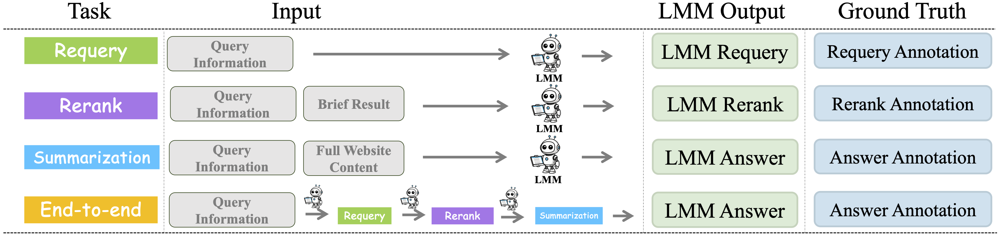

# MMSearch 🔥🔍: Benchmarking the Potential of Large Models as Multi-modal Search Engines

 
 
 

 


Official repository for "[MMSearch: Benchmarking the Potential of Large Models as Multi-modal Search Engines](https://arxiv.org/pdf/2409.12959)".

🌟 For more details, please refer to the project page with dataset exploration and visualization tools.

[[🌐 Webpage](https://mmsearch.github.io/)] [[📖 Paper](https://arxiv.org/pdf/2409.12959)] [[🤗 Huggingface Dataset](https://huggingface.co/datasets/CaraJ/MMSearch)] [[🏆 Leaderboard](https://mmsearch.github.io/#leaderboard)] [[🔍 Visualization](https://huggingface.co/datasets/CaraJ/MMSearch/viewer)]


## 💥 News

- **[2024.09.25]** 🌟 The [evaluation code](https://github.com/CaraJ7/MMSearch#-evaluation-by-yourself) now supports directly use models implemented in [VLMEvalKit](https://github.com/open-compass/VLMEvalKit)!
- **[2024.09.22]** 🔥 We release the [evaluation code](https://github.com/CaraJ7/MMSearch#-evaluation-by-yourself), which you only need to add an inference API of your LMM!
- **[2024.09.20]** 🚀 We release the [arXiv paper](https://arxiv.org/abs/2409.12959) and some data samples in the [visualizer](https://huggingface.co/datasets/CaraJ/MMSearch/viewer).

## 📌 ToDo

- Coming soon: *MMSearch-Engine* for new query, *MMSearch-Engine* demo, evaluation with [lmms-eval](https://github.com/EvolvingLMMs-Lab/lmms-eval).

## 👀 About MMSearch

The capabilities of **Large Multi-modal Models (LMMs)** in **multimodal search** remain insufficiently explored and evaluated. To fill the blank of a framework for LMM to conduct multimodal AI search engine, we first design a delicate pipeline **MMSearch-Engine** to facilitate **any LMM** to function as a multimodal AI search engine

<p align="center">
     <br>
</p>

To further evaluate the potential of LMMs in the multimodal search domain, we introduce **MMSearch**, an all-around multimodal search benchmark designed for assessing the multimodal search performance. The benchmark contains 300 manually collected instances spanning 14 subfields, which involves no overlap with the current LMMs' training data, ensuring the correct answer can only be obtained within searching.

<p align="center">
     <br>
    An overview of <b>MMSearch</b>.
</p>

In addition, we propose a **step-wise evaluation strategy** to better understand the LMMs' searching capability. The models are evaluated by performing **three individual tasks (requery, rerank, and summarization)**, and **one challenging end-to-end task** with a complete searching process. The final score is weighted by the four tasks.

<p align="center">
     <br>
    Outline of Evaluation Tasks, Inputs, and Outputs.
</p>

<details>
<summary>🔍 An example of LMM input, output, and ground truth for four evaluation tasks</summary>

<p align="center">
     <br>
</p>
</details>

## Evaluation

#### Setup Environment 

The environment is mainly for interacting with the search engine and crawling the website:

```bash
pip install requirements.txt
playwright install
```

### ✨ Evaluation with models implemented in [VLMEvalKit](https://github.com/open-compass/VLMEvalKit)

We now support directly use the models implemented in [VLMEvalKit](https://github.com/open-compass/VLMEvalKit). You need to first install VLMEvalKit with the following command, or follow the guidance in its repo:

```bash
git clone https://github.com/open-compass/VLMEvalKit.git
cd VLMEvalKit
pip install -e .
```

Then, you can directly use the models implemented in VLMEvalKit, the available name list of the model is [here](https://github.com/open-compass/VLMEvalKit/blob/main/vlmeval/config.py). 

To use the model, simply add the prefix `vlmevalkit_` in front of the model name in the list. For example, to use `llava_onevision_qwen2_7b_ov`, your input `model_type` should be `vlmevalkit_llava_onevision_qwen2_7b_ov`. We provide an example of the rerank task in `scripts/run_requery_vlmevalkit.sh`.

**Note that, several model in VLMEvalKit do not support text-only inference, so it may not support end2end task (some queries in round1 do not have image input).**

### 💪 Evaluation with custom LMMs

Here, **we support evaluation of any custom LMMs with only very little effort**. To evaluate your LMM, you only need to provide an `infer` function, which takes the image files and text instructions as input and outputs the model response.

#### Evaluation

Note that there are four tasks for computing the final score of MMSearch: end2end, requery, rerank, and summarization. 

The requery task is automatically evaluated when conducting the end2end task. Therefore, to evaluate all the tasks in MMSearch, you only need to conduct evaluation on the end2end, rerank and summarization tasks. The evaluation codes are as follows:

```bash
# end2end task
bash scripts/run_end2end.sh
# rerank task
bash scripts/run_rerank.sh
# summarization task
bash scripts/run_summarization.sh
```

After the three scripts complete, run the following code to get the final score:

```bash
bash scripts/run_get_final_score.sh
```

Here are some important notes:

1. **How to set the parameters?**
   + We provide the example input args in the bash file mentioned above.
   + The end2end task needs to interact with the Internet and the search engine. Please adjust the timeout time in `constants.py` for loading the website according to your network status.

2. **How to add my LMM for evaluation?**

   We implement the code of LLaVA-OneVision in `models/llava_model.py`. **Adding a model is very simple with only two steps**:

   1. Implement a class for the model. The model class must implement the `infer` function, which takes image files and text instructions as input. Please refer to `models/llava_model.py` for the illustration of input variable types.
   2. Add the model type in ``models/load.py``. Then you can specify the model_type in your bash file and use your model!

3. **Evaluation time and multiple gpus inference**

   Typically, the end2end task takes the longest time since it conducts three rounds sequentially and needs to interacte with the Internet. We provide a very basic mechanism for inference with multiple GPUs, where we provide an example in `scripts/run_rerank_parallel.sh` . However, **we do not recommend running end2end task with too many GPUs** since it will hit the rate limit of the search engine API and refuse to respond.


## 🏆 Leaderboard

### Contributing to the Leaderboard

🚨 The [Leaderboard](https://mmsearch.github.io/#leaderboard) is continuously being updated, welcoming the contribution of your excellent LMMs!

### Data Usage

We release the MMSearch data for benchmarking on the leaderboard, which contains *300* queries and the middle results for step-wise evaluation.

You can download the dataset from the [🤗 Huggingface](https://huggingface.co/datasets/CaraJ/MMSearch) by the following command (make sure that you have installed [related packages](https://huggingface.co/docs/datasets/quickstart)):

```python
from datasets import load_dataset

dataset = load_dataset("CaraJ/MMSearch")
```


## :white_check_mark: Citation

If you find **MMSearch** useful for your research and applications, please kindly cite using this BibTeX:

```latex
@article{jiang2024mmsearch,
  title={MMSearch: Benchmarking the Potential of Large Models as Multi-modal Search Engines},
  author={Jiang, Dongzhi and Zhang, Renrui and Guo, Ziyu and Wu, Yanmin and Lei, Jiayi and Qiu, Pengshuo and Lu, Pan and Chen, Zehui and Song, Guanglu and Gao, Peng and others},
  journal={arXiv preprint arXiv:2409.12959},
  year={2024}
}
```

## 🧠 Related Work

Explore our additional research on **Vision-Language Large Models**:

- **[MathVerse]** [MathVerse: Does Your Multi-modal LLM Truly See the Diagrams in Visual Math Problems?](https://mathverse-cuhk.github.io/)
- **[MathVista]** [MathVista: Evaluating Mathematical Reasoning of Foundation Models in Visual Contexts](https://github.com/lupantech/MathVista)
- **[LLaMA-Adapter]** [LLaMA-Adapter: Efficient Fine-tuning of Language Models with Zero-init Attention](https://github.com/OpenGVLab/LLaMA-Adapter)
- **[LLaMA-Adapter V2]** [LLaMA-Adapter V2: Parameter-Efficient Visual Instruction Model](https://github.com/OpenGVLab/LLaMA-Adapter)
- **[ImageBind-LLM]** [Imagebind-LLM: Multi-modality Instruction Tuning](https://github.com/OpenGVLab/LLaMA-Adapter/tree/main/imagebind_LLM)
- **[SPHINX]** [The Joint Mixing of Weights, Tasks, and Visual Embeddings for Multi-modal LLMs](https://github.com/Alpha-VLLM/LLaMA2-Accessory/tree/main/SPHINX)
- **[SPHINX-X]** [Scaling Data and Parameters for a Family of Multi-modal Large Language Models](https://github.com/Alpha-VLLM/LLaMA2-Accessory/tree/main/SPHINX)
- **[Point-Bind & Point-LLM]** [Multi-modality 3D Understanding, Generation, and Instruction Following](https://github.com/ZiyuGuo99/Point-Bind_Point-LLM)
- **[PerSAM]** [Personalize segment anything model with one shot](https://github.com/ZrrSkywalker/Personalize-SAM)
- **[CoMat]** [CoMat: Aligning Text-to-Image Diffusion Model with Image-to-Text Concept Matching](https://caraj7.github.io/comat/)
